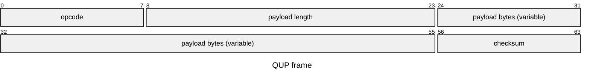
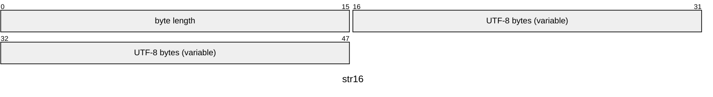
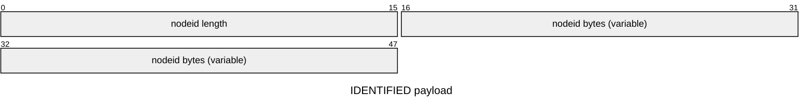
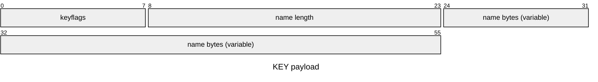
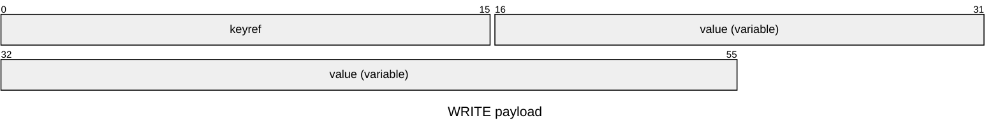
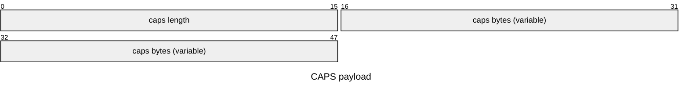

# QUP Protocol

> The key words `MUST`, `MUST NOT`, `SHOULD`, `SHOULD NOT`, and `MAY` in this document are to be interpreted as described in RFC 2119 and RFC 8174 when, and only when, they appear in all capitals.

> Unless otherwise specified, this document and all sections therein is normative. The examples in this document are non-normative and are provided for illustrative purposes only.

This document defines QUP wire framing, scalar and variable-length encodings, command vocabulary, and connection behavior.

The current command set covers compatibility signaling, node identification, keytab enumeration, key/value reads and writes, and node-initiated changed notifications. Relay-managed subscriptions and mirroring rules are out of scope for this document.

## Overview

> This section, up until the next header, is non-normative.

QUP is a low-level binary protocol for interactions between a node (typically an embedded device, but may exist in other forms) and a client that queries or updates the node's state.

The protocol focuses primarily on a fixed set of key/value pairs for a "global" namespace of the node's state. Both the client and the node may change the values for those keys, and the client may observe changes to those keys through notifications.

The intended use for the QUP protocol is for extraction of telemetry, configuring devices, and for signaling and data replication among a larger 'mesh' of nodes and transports.

It is not intended as a general-purpose message bus, RPC framework, or production queue replacement, and is not suited for bulk data transfer or high-throughput workloads.

## Basic Principles

- QUP is a binary protocol.
- A client sends requests to a node.
- A node sends ordinary success responses, error responses, and changed notifications to a client.
- Every frame is self-delimiting.
- QUP assumes a reliable, ordered, duplex transport.
- Connections to a node are stateless, aside from observed key subscriptions. There is no explicit negotiation phase.
- A node MAY persist key values across client disconnects and reconnects.
- Opening or closing a connection does not by itself reset key values or other node state as part of this protocol, aside from observed key subscriptions.
- A client MAY pipeline requests.
- Ordinary responses other than `!` MUST be emitted in request order.
- `@` is an ordinary request-level failure response. It is not a protocol error (see _Protocol Errors_).
- `!` is a node-initiated notification. Its ordering is otherwise undefined except where this document constrains it explicitly.
- The minimal command set that every node MUST implement is `GETCAPS`.

## Connection Model

- A node MUST NOT service a request until the entire request frame has been received and validated.
- Transport termination ends parsing. A partially received frame is discarded.
- A request that has already been fully received and accepted for service is not rolled back automatically if the transport later fails while sending the response.
- The protocol does not define automatic retry, automatic rollback, or automatic re-emission of responses after transport failure.
- If a malformed request causes a protocol error, a node MAY terminate the connection immediately. Behavior for any unread or queued pipelined requests on that connection is undefined.
- If a malformed response causes a protocol error, a client MAY terminate the connection immediately. Behavior for any unread or queued pipelined requests on that connection is undefined.
- If a request receives `@`, later valid pipelined requests on the same connection MUST still be processed in order.
- On a new connection, a node MUST begin with observation disabled for all keys.
- A client that needs to know whether a prior request succeeded or failed before issuing a later request SHOULD wait for the earlier response before sending the later request.
- A new connection never resumes pending responses from an older connection.
- A new connection never receives historical `!` notifications. It MAY receive new `!` notifications for later changes, but only after a successful `OBSERVE` for the corresponding key.

## Typical Interaction

1. A client connects to a node.
2. A client SHOULD issue `GETCAPS`.
3. If the client issued `GETCAPS`, the node returns `CAPS`.
4. A client decides whether it understands the advertised opcode set.
5. A client issues normal requests.

After advertising `CAPS`, it is a client's responsibility to decide whether it can safely continue talking to a node.

If a client issues an `OBSERVE` request and receives a successful response, the client MUST expect out-of-band `!` messages for that key to arrive at any time until the client issues a successful `UNOBSERVE` for that key.

Pseudocode for receiving out-of-band `!` by the client:

```text
send(request)

response = receive()
while response.opcode == '!':
  handle_changed_notification(response)
  response = receive()

handle_response(response)
```

## Frame Layout

Every QUP message is transmitted as a single frame:



```text
+--------+-------------+--------------+----------+
| opcode | length:u16  | payload      | checksum |
+--------+-------------+--------------+----------+
| 1 byte | 2 bytes BE  | length bytes | 1 byte   |
+--------+-------------+--------------+----------+
```

Field meanings:

- `opcode`: the message kind.
- `length`: the payload length in bytes, encoded as an unsigned 16-bit big-endian integer.
- `payload`: the message body, whose interpretation is defined by the opcode.
- `checksum`: an 8-bit additive checksum over the frame.

Because the frame length is `u16`, a payload MUST be at most `65535` bytes long.

The checksum is chosen so that the wrapping sum of every byte in the complete frame, in frame order and including the checksum byte, is equal to zero modulo `256`.

In pseudocode:

```text
acc = 0u8
acc = acc.wrapping_add(opcode)
acc = acc.wrapping_add(length[0])
acc = acc.wrapping_add(length[1])
for byte in payload:
  acc = acc.wrapping_add(byte)
checksum = 0u8.wrapping_sub(acc)
```

A receiver validates a frame in this order:

1. Read `opcode`.
2. Read `length`.
3. Read exactly `length` payload bytes.
4. Read the checksum byte.
5. Verify the wrapping sum over the full frame.
6. Dispatch the frame by opcode.

Validation pseudocode:

```text
opcode = read_u8()
length_hi = read_u8()
length_lo = read_u8()
length = (length_hi << 8) | length_lo

acc = 0u8
acc = acc.wrapping_add(opcode)
acc = acc.wrapping_add(length_hi)
acc = acc.wrapping_add(length_lo)

payload = read_exact(length)
for byte in payload:
  acc = acc.wrapping_add(byte)

checksum = read_u8()
acc = acc.wrapping_add(checksum)

if acc != 0:
  protocol_error()

dispatch(opcode, payload)
```

## Encodings

### Scalars

- `u8`, `u16`, `u32`, `u64`: unsigned integers in big-endian order.
- `i64`: signed two's-complement integer in big-endian order.
- `bool`: one byte. `0x00` is false and `0x01` is true.
- `opcode`: one ASCII byte whose valid values, classes, and direction rules are defined in the `Opcode Classes` section.

### Variable-Length Data

QUP uses only 16-bit length-prefixed variable-length fields.

- `bytes16`: `len:u16` followed by `len` bytes.
- `str16`: `len:u16` followed by `len` UTF-8 bytes.



Rules:

- `str16` length counts bytes, not Unicode scalar values.
- Strings MUST be valid UTF-8.
- Strings MUST NOT contain `0x00` anywhere.
- There is no implicit terminator.
- There is no implicit padding or alignment.
- If any internal length prefix exceeds the remaining payload bytes in the containing frame, the payload is malformed.

## Opcode Classes

The opcode byte defines the direction and class of a frame:

- `A` through `Z`: client-to-node request opcodes.
- `a` through `z`: node-to-client ordinary success response opcodes.
- `@`: node-to-client error response.
- `!`: node-to-client changed notification.
- `?`: client-to-node compatibility request.
- `:`: node-to-client compatibility response.
- All other opcodes are reserved.

Direction rules:

- A client MUST NOT send `a` through `z`, `@`, `!`, or `:`.
- A node MUST NOT send `A` through `Z` or `?`.

Any reserved or directionally invalid opcode is a protocol error.

## Compatibility

Compatibility is based on advertised opcode behavior rather than version fields.

- `GETCAPS` is the only command that every node MUST implement.
- The shortest valid `CAPS` response is an empty `str16`.
- An empty `CAPS` string means that a node supports no command other than `GETCAPS` and does not support `!`.
- A client SHOULD issue `GETCAPS` after connecting.
- A node's capabilities MUST remain fixed for the lifetime of the connection.
- Every `GETCAPS` request on the same connection MUST return the same `CAPS` payload.
- `CAPS` reports the capability set already in effect on the connection rather than activating or changing capabilities. In essence, a `GETCAPS` / `CAPS` exchange is _not_ a negotiation, and MUST NOT incur side effects in a node beyond the cost of processing the request and issuing the response.
- A node MUST advertise only ordinary request/ordinary success response pairs defined by this document.
- A node MUST accurately advertise every ordinary request it will service and every ordinary success response it will send for the lifetime of the connection.
- A node MUST advertise `!` if it may emit `!` on that connection.
- An opcode that a node implements but does not advertise MUST be treated exactly as if it were never implemented: a node MUST return `@` with code `0x06` (or protocol error if malformed) and MUST NOT execute the command.

`CAPS` uses a single `str16` payload called `caps` (see the `GETCAPS` section).

The `caps` string contains zero or more ordinary request/response pairs followed optionally by a terminal `!`:

```text
<request><success_response><request><success_response>... [!]
```

Rules for `caps`:

- The string MUST be ASCII.
- `?`, `:`, and `@` MUST NOT appear.
- Each ordinary pair MUST be one request opcode in `A` through `Z` followed by the exact ordinary success response opcode defined for that request in the Requests section.
- If `!` appears, it MUST appear exactly once and it MUST be the last byte of the string.
- `!` is the only reason the string MAY have odd length.
- If the same request opcode appears multiple times, every occurrence MUST use the same ordinary success response. The payload is otherwise malformed.
- A client MUST ignore duplicate identical pairs.
- A client MUST ignore any advertised pair it does not recognize as a unit (a request opcode followed by its defined ordinary success response).

Examples:

- `PkIiCcSsGgWwNkUk` advertises `PING`, `IDENTIFY`, `GETKEYTABLEN`, `GETKEY`, `GET`, `WRITE`, `OBSERVE`, and `UNOBSERVE`.
- `NkUk!` advertises `OBSERVE`, `UNOBSERVE`, and `!` notification support.
- `PkPg` is malformed because `P` appears with two different ordinary success responses.

If `!` is omitted from `CAPS`, a client MUST NOT assume that a node will emit changed notifications.

## Protocol Errors

A protocol error is any deviation from the frame, opcode, or payload rules in this document.

The following conditions are protocol errors:

- a checksum that does not validate
- a reserved or unknown opcode
- an opcode sent in the wrong direction
- a client sending a request opcode that a node did not advertise in `CAPS` after having previously received a `CAPS` response on this connection
- an ordinary success response opcode that does not match the ordinary success response defined for the next outstanding request
- an error response opcode with an error code not specified as a valid error code for the next outstanding request
- a node sending an ordinary success response or `!` that it did not advertise in `CAPS`
- a node sending `!` for a key that is not currently observed on the connection
- a node sending `!` whose `keyref` is outside the current keytab range
- a malformed payload encoding (described below)
- any other deviation from the specified frame or payload structure

Malformed payload encoding includes at least the following cases:

- an internal length prefix that exceeds the remaining payload bytes in the frame (e.g. a packet length of `10` with a `str16` whose length prefix is `20`)
- invalid UTF-8 in a `str16`
- any `0x00` byte inside a `str16`
- a `bool` value other than `0x00` or `0x01`
- a `keyflags` value with bits set outside bit `0`, bit `1`, and bit `2`
- a `value.kind` that is not defined by this document
- a malformed `CAPS` string

Transport termination is not itself a protocol error. It ends parsing.

The receiver of a protocol error MUST immediately terminate or otherwise reset the connection in a way that the other side can detect (e.g. by closing the transport, or by resetting a serial connection, etc.).

Both sides MUST stop processing any pending or future frames on that connection after a protocol error. Behavior for any unread or queued pipelined requests on that connection is undefined.

## Shared Payload Types

### `nodeid`

- `nodeid` is `str16`.

### `keyref`

- `keyref` is `u16`.
- If `count` is the value returned by `GETKEYTABLEN`, a valid key reference satisfies `0 <= keyref < count` on the current connection.
- A client-supplied `keyref` outside the range `0 <= keyref < count` MUST be answered with `@` code `0x01` (unknown key reference).

### `keyflags`

`keyflags` is one byte:

- bit `0`: readable
- bit `1`: writable
- bit `2`: observable
- all other bits MUST be zero

`keyflags = 0x00` means that the key is neither readable, writable, nor observable. Nodes MAY use such entries to retain stable key references for voided or retired keys.

### `value`

`value` is encoded as `kind:u8` followed by a kind-dependent body.


The bytes after `kind` are variable and depend on `kind`.

Defined `kind` values:

- `0x01`: `bool`
- `0x02`: `i64`
- `0x03`: `str16`

## Keytab Rules

- `GETKEYTABLEN` returns the total number of key references on the current connection.
- That count includes keys whose `keyflags` value is `0x00`.
- A node MUST keep the keytab stable for the lifetime of a connection.
- Keytab stability means that `GETKEYTABLEN` returns the same `count` for the connection and, for every in-range `keyref`, `GETKEY` returns the same `keyflags` and `name` for the connection.
- A client MUST NOT assume that the same key references map to the same names after reconnecting.
- `GETKEY` MUST succeed for every in-range `keyref`, even if the key is voided and `keyflags = 0x00`.
- A node MAY return an empty string for a key name.

## Request Error Model

- `@` is the request-level error response opcode.
- `@` is valid in place of any request's ordinary success response.
- `@` payloads are always `code:u8`.
- Error code meanings are request-dependent.
- A node MUST NOT send request-level error codes other than those explicitly listed for the request being answered.
- A client that receives an unknown error code for a request MUST treat it as an unknown request-level failure, not as a protocol error. This rule exists for forward compatibility.
- Nodes MUST NOT use reserved or unspecified error codes. This facilitates future expansion.
- Unless a request section says otherwise, requests resulting in the listed `@` error codes MUST NOT incur side effects.
- Malformed request payloads do not use `@`; they are protocol errors.

## Requests

Unless stated otherwise, all request payload diagrams below describe the exact field order with no padding. Variable-length fields consume the number of bytes stated by their length prefixes.

### `P` PING -> `k` OK

Verifies that a node is reachable.

#### Request Payload

- none

#### Ordinary Success Response

- `k` with zero-length payload

#### Error Codes

- none

#### Side Effects

- none

### `I` IDENTIFY -> `i` IDENTIFIED

Returns the connected node identifier.

#### Request Payload

- none

#### Ordinary Success Response

- `nodeid`



#### Error Codes

- none

#### Side Effects

- none

### `C` GETKEYTABLEN -> `c` KEYTABLEN

Returns the number of key references exposed by a node on the current connection.

#### Request Payload

- none

#### Ordinary Success Response

- `count:u16`


#### Error Codes

- none

#### Side Effects

- none

### `S` GETKEY -> `s` KEY

Returns metadata for a key reference.

#### Request Payload

- `keyref`


#### Ordinary Success Response

- `keyflags:u8`
- `name:str16`



#### Error Codes

- `0x01`: unknown key reference

#### Side Effects

- none

### `G` GET -> `g` VALUE

Reads the current value for a key.

#### Request Payload

- `keyref`


#### Ordinary Success Response

- `value`

#### Error Codes

- `0x01`: unknown key reference
- `0x02`: key is not readable

#### Side Effects

- none

### `W` WRITE -> `w` WRITTEN

Requests an update to a key.

#### Request Payload

- `keyref`
- `value`



#### Ordinary Success Response

- `value`

#### Error Codes

- `0x01`: unknown key reference
- `0x02`: key is not writable
- `0x03`: type mismatch

#### Side Effects

- `0x01`, `0x02`, and `0x03` incur no side effects.
- A successful `WRITE` updates the key value.

### `N` OBSERVE -> `k` OK

Requests notification enablement for a key on the current connection.

#### Request Payload

- `keyref`


#### Ordinary Success Response

- `k` with zero-length payload

#### Error Codes

- `0x01`: unknown key reference
- `0x02`: key is not observable

#### Side Effects

- `0x01` and `0x02` incur no side effects.
- A successful `OBSERVE` enables observation state for that key on the current connection.
- A successful `OBSERVE` does not guarantee that any `!` will be delivered.

### `U` UNOBSERVE -> `k` OK

Requests notification disablement for a key on the current connection.

#### Request Payload

- `keyref`


#### Ordinary Success Response

- `k` with zero-length payload

#### Error Codes

- `0x01`: unknown key reference

#### Side Effects

- `0x01` incurs no side effects.
- After a node emits the success `k` for `UNOBSERVE(keyref)`, it MUST NOT emit later `!` notifications for that same `keyref` on that connection.
- Before that success `k` is emitted, `!` for the same `keyref` MAY still arrive.
- `UNOBSERVE` called on a `keyref` that is marked as unobservable by `GETKEY` is a no-op that MUST succeed with `k` and incur no side effects.
- It is never an error to `UNOBSERVE` a key except in the case of an unknown `keyref`.

## Control Messages

### `?` GETCAPS -> `:` CAPS

Returns a node's advertised opcode set.

#### Request Payload

- none

#### Ordinary Success Response

- `caps:str16`



#### Error Codes

- none

#### Side Effects

- none

### `!` CHANGED

`CHANGED` notifies a client that a key changed.

#### Payload

- `keyref`


#### Rules

- `!` does not carry the new value.
- A client that wants the new value SHOULD issue `GET`.
- A node MUST NOT emit `!` unless `OBSERVE(keyref)` previously succeeded on that connection and `UNOBSERVE(keyref)` has not subsequently succeeded on that connection.
- Ordering of `!` relative to other frames is undefined except where this document constrains it.
- If a successful `WRITE` updates a key and a node also emits `!` for that same key on that connection, the `w` response MUST be sent before the `!`.
- A client MAY ignore any valid `!`.
- There is no acknowledgement by the client for `!`.

### `@` ERROR

`ERROR` is the request-level failure response.

#### Payload

- `code:u8`


#### Rules

- `@` is valid in place of any request's ordinary success response.
- `@` MUST NOT appear in `CAPS`.
- Unknown `code` values are not protocol errors.
- Error code meaning depends on the request being answered.

## Response Ordering

- A node processes fully received and validated requests in strict FIFO order. The ‘next outstanding request’ is the oldest request that has not yet received any response (`@` or its ordinary success response).
- Responses to pipelined requests MUST be emitted in the same order as those requests were accepted.
- For each request, a node MUST emit either the request's specified ordinary success response or `@`.
- Any other response opcode for that request is a protocol error.
- `@` does not affect later pending pipelined requests.
- `!` MAY appear anywhere relative to pipelined responses except where `WRITE` and `UNOBSERVE` constrain it.

## Examples

The checksums shown in the following examples are illustrative only. If any example payload changes, the checksum MUST be recalculated.

### `GETCAPS` Request

```text
3F 00 00 C1
```

- `3F`: `?`
- `0000`: zero-length payload
- `C1`: checksum

### Empty `CAPS` Response

This is the shortest valid `CAPS` response.

```text
3A 00 02 00 00 C4
```

- `3A`: `:`
- `0002`: two payload bytes follow
- `0000`: empty `str16`
- `C4`: checksum

An empty `CAPS` string means that a node only supports `GETCAPS`.

### `CAPS` Response With Terminal `!`

This example advertises `OBSERVE -> k`, `UNOBSERVE -> k`, and `!` support.

```text
3A 00 07 00 05 4E 6B 55 6B 21 20
```

### `PING` Request and `OK` Response

Request:

```text
50 00 00 B0
```

Response:

```text
6B 00 00 95
```

### `GETKEY(1)` Request

```text
53 00 02 00 01 AA
```

- `53`: `S`
- `0002`: two payload bytes follow
- `0001`: `keyref = 1`
- `AA`: checksum

### Example `KEY` Response

This example returns `keyflags = 0x07` and `name = "led"`.

```text
73 00 06 07 00 03 6C 65 64 48
```

### Example `ERROR` Response

This example returns request-level error code `0x02`.

```text
40 00 01 02 BD
```

### Example `CHANGED(1)` Notification

```text
21 00 02 00 01 DC
```